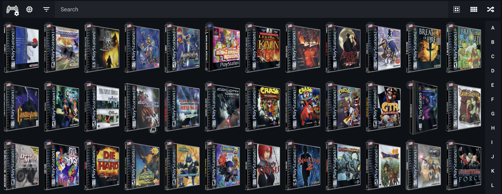

<!-- trunk-ignore-all(markdownlint/MD001) -->
<!-- trunk-ignore-all(markdownlint/MD041) -->

RomM supports multiple metadata providers to enrich your game library with titles, descriptions, cover art, and achievements. You don't need all providers, so this guide covers [popular combos](#popular-combos) and [setup instructions](#setup-instructions).

## Popular combos

Here are some combinations you can use based on your needs:

#### ⭐ The French Connection: [ScreenScraper](#screenscraper) + [Retroachievements](#retroachievements)

- Supports 125+ popular systems
- ScreenScraper provides titles, descriptions, cover art, screenshots and manuals
    - Also supports hash-based matching (as of `v4.4`)
    - With the option for 3D boxes and CD/cartridge covers
- Retroachievements provides achievement progress
- **Use this if you want to avoid Twitch/Amazon products**



#### ⭐ The Chef's Choice: [Hasheous](#hasheous) + [IGDB](#igdb) + [SteamGridDB](#steamgriddb) + [Retroachievements](#retroachievements)

- Supports 135+. popular systems
- Hasheous provides hash-based matching and proxies IGDB data (titles, descriptions and artwork)
- IGDB adds additional metadata like related games and screenshots
- SteamGridDB provides high-quality alternative cover art
- Retroachievements provides achievement progress
- **This is the recommended setup for most users**


#### The Twitch Fanboy: [IGDB](#igdb) + [PlayMatch](#playmatch)

- Supports the 200+ systems available on IGDB
- Provides titles, descriptions, cover art and related games from IGDB
- PlayMatch adds hash-based matching for unmatched files
- **Use this if you want a single-provider solution**

#### The Quick Starter: [Hasheous](#hasheous)

- Hash-based matching only ⚠️
- Proxies titles, descriptions and cover art from IGDB
- Incredibly fast scan times
- **For users who want to avoid API keys**

## Setup instructions

### IGDB

[IGDB](https://www.igdb.com/) (Internet Game Database) is a popular metadata provider that offers metadata, cover art, screenshots, related games and more.

To access the IGDB API you'll need a Twitch account and a valid phone number for 2FA verification. Up-to-date instructions are available in the [IGDB API documentation](https://api-docs.igdb.com/#account-creation). When registering your application in the Twitch Developer Portal, fill out the form like so:

- Name: Something **unique or random** like `romm-3fca6fd7f94dea4a05d029f654c0c44b` or `KVV8NDXMSRFJ2MRNPNRSL7GQT`
- OAuth Redirect URLs: `localhost`
- Category: `Application Integration`
- Client Type: `Confidential`

<!-- prettier-ignore -->
!!! important  
    The name you pick has to be unique! Picking an existing name will fail silently, with no error messages. We recommend using `romm-<random hash>`, like `romm-3fca6fd7f94dea4a05d029f654c0c44b`

Note the client ID and secret that appear on screen, and use them to set `IGDB_CLIENT_ID` and `IGDB_CLIENT_SECRET` in your environment variables.

<!-- prettier-ignore -->
??? Screenshots
    
    

### ScreenScraper

[ScreenScraper.fr](https://screenscraper.fr/) is a French provider that offers metadata, cover art, screenshots and manuals, along with the option for 3D boxes and CD/cartridge cover art. It supports a wide range of systems and is a great alternative to IGDB.

To access the ScreenScraper API, create a [ScreenScraper](https://www.screenscraper.fr/membreinscription.php) account and copy the **user** and **password** you just created to `SCREENSCRAPER_USER` and `SCREENSCRAPER_PASSWORD` respectively.

### MobyGames

MobyGames is a metadata provider that offers metadata, cover art and screenshots.

To access the MobyGames API, [create a MobyGames account](https://www.mobygames.com/user/register/) and then visit your profile page. Click the **API** link under your user name to sign up for an API key. Copy the key shown and use it to set `MOBYGAMES_API_KEY`.

<!-- prettier-ignore -->
!!! important
    Access to the MobyGames API is a [paid feature](https://www.mobygames.com/info/api/#non-commercial). While we will continue to support it, we recommend using [ScreenScraper](#screenscraper) instead, as it is free to use.

### LaunchBox

The [LaunchBox](https://gamesdb.launchbox-app.com/) Games Database is a community-driven database that provides metadata, cover art, and screenshots. Like the Launchbox desktop application, RomM downloads the entire database locally and matches games based on their exact filenames.

To enable LaunchBox, set `LAUNCHBOX_API_ENABLED=true` and `ENABLE_SCHEDULED_UPDATE_LAUNCHBOX_METADATA=true` in your environment variables. You can customize scheduled updates of the database by setting the frequency on the cron job with `SCHEDULED_UPDATE_LAUNCHBOX_METADATA_CRON` (defaults to 5:00 AM every day).

You must run a LaunchBox metadata update (either manually, or scheduled via cron) to generate a local `.xml` file with Launchbox metadata before using it as a metadata provider. The server will parse the local `.xml` file when trying to match a ROM and fetch metadata from this source.

### Hasheous

[Hasheous](https://hasheous.org/) is a free, open-source metadata provider that uses file hashes to match games. It proxies IGDB data for titles, descriptions, and cover art, and can provide Retroachievements IDs for matched games.

Simply set `HASHEOUS_API_ENABLED=true` in your environment variables, and future scans will start using the [Hasheous API](https://hasheous.org/swagger/index.html).

### PlayMatch

[PlayMatch](https://github.com/RetroRealm/playmatch) is a hash-based matching service used in conjunction with IGDB to provide better matching for games, hosted by a member of our community.

To enable PlayMatch, set `PLAYMATCH_API_ENABLED=true` in your environment variables.

### SteamGridDB

SteamGridDB provides custom cover art for games or collections. It's not accessed through the scanner but from the "search cover" button when manually editing a game.

To access the SteamGridDB API, you need to login to their [website](https://www.steamgriddb.com/) with a [Steam account](https://store.steampowered.com/join). Once logged in, go to your [API tab under the preferences page](https://www.steamgriddb.com/profile/preferences/api). Copy the key shown and use it to set `STEAMGRIDDB_API_KEY`.

### RetroAchievements

RomM is able to display your achievements from [RetroAchievements](https://retroachievements.org/). To sync it with your RomM instance, you need to generate an API key from your RetroAchievements account in your [settings](https://retroachievements.org/settings).

Copy the key shown and use it to set `RETROACHIEVEMENTS_API_KEY` and perform a `UNMATCHED` scan targeting the platform you want to match with RetroAchievements.

After that, each user needs to set their own username in their profile and sync it with RetroAchievements. A new `Achievements` tab will appear in the `Personal` tab in the game details.

To avoid unnecessary API calls, a cached file with the RA database is stored in RomM. Refresh time for that cache file can be changed with the environment variable `REFRESH_RETROACHIEVEMENTS_CACHE_DAYS`.

<!-- prettier-ignore -->
??? Screenshots
    
    

### Flashpoint

The [Flashpoint Project Database](https://flashpointproject.github.io/flashpoint-database/) is a project that enables metadata for 180,000+ flash and browser-based games. Enable this metadata source with the `FLASHPOINT_API_ENABLED=true` environment variable. If you are adding this provider to an existing RomM setup, perform a `UNMATCHED` scan with Flashpoint selected to update an existing platform.

### How Long To Beat

The [How Long To Beat](https://howlongtobeat.com/) project provides game completion times for more than 84,000 games. Enable this metadata source with the `HLTB_API_ENABLED=true` environment variable. If you are adding this provider to an existing RomM setup, perform a `UNMATCHED` scan with How Long To Beat selected to update an existing platform.

Game completion times will be added to a new tab on the details page for supported matched games.

### ES-DE gamelist.xml

EmulationStation, and it's modern successor ES-DE, use a custom XML format to store game metadata. RomM can parse this format and import the assets as cover art and screenshots. You'll need to store the gamelist.xml file and any related assets under the platform folder:

<!-- prettier-ignore -->
```yaml
library/
└─ roms/
    └─ gba/
        ├─ game_1.gba
        ├─ game_2.gba
        ├─ gamelist.xml
        ├─ 3dboxes/
        │  ├─ game_1.png
        │  └─ game_2.png
        ├─ covers/
        ├─ screenshots/
        └─ etc...
```

#### ES-DE settings

Here are the settings you need to change so RomM can read your artwork and gamelist.xml files from the same folder that holds your ROMs.

1. Open the ES-DE settings file:

    - Linux / macOS: `~/ES-DE/settings/es_settings.xml`
    - Windows: `C:\Program Files\ES-DE\settings\es_settings.xml`

2. Make these two edits (add the lines if they don’t exist):

```xml
<string name="MediaDirectory" value="/path/to/ROMs/folder" />
<bool name="LegacyGamelistFileLocation" value="true" />
```

    - `MediaDirectory="/path/to/ROMs/folder"` download artwork into the same directory that contains the ROMs (should match `ROMDirectory`)
    - `LegacyGamelistFileLocation="true"` forces gamelist.xml to be written next to the ROMs instead of inside the ES-DE config folder

3. If you already have scraped artwork, copy/move the systems from `~/ES-DE/downloaded_media/` and `~/ES-DE/gamelists/` into your ROMs folder

After a restart, ES-DE will place new artwork and the updated gamelist.xml directly in `roms/<system>/`, which is the layout RomM expects.

## Metadata Tags in Filenames

Scans will now parse custom metadata tags in the filename that match specific patterns, and use them to fetch game metadata for the specified ID. The supported tags are:

(igdb-xxxx) for [IGDB](https://www.igdb.com/)
(moby-xxxx) for [MobyGames](https://www.mobygames.com/)
(ra-xxxx) for [RetroAchievements](https://retroachievements.org/)
(ssfr-xxxx) for [ScreenScraper](https://screenscraper.fr/)
(launchbox-xxxx) for [Launchbox](https://gamesdb.launchbox-app.com/)
(hltb-xxxx) for [HowLongToBeat](https://howlongtobeat.com/)

Filenames will not be renamed by RomM to add tags, as they are a non-standard formatting system and could create conflicts with other software.
