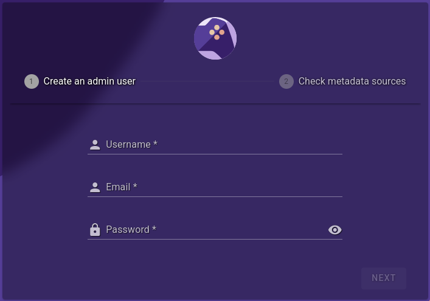

<!-- trunk-ignore-all(markdownlint/MD041) -->

## Prerequisites

Before getting started, install the [Community Apps plugin](https://forums.unraid.net/topic/38582-plug-in-community-applications/) for Unraid.

Install [Docker Compose Addon](https://forums.unraid.net/topic/114415-plugin-docker-compose-manager/) from the CA (Community Apps Store)

### Docker Tab

You will now see Compose option under the Docker Containers in your Docker Tab in Unraid

## Installation

Click **Add New Stack**

- Name it **RomM** and click **OK**

- Click the **Gear Icon**, edit stack, then edit the compose file

- Add in the example Docker Compose from our [example docker-compose.yml](https://github.com/rommapp/romm/blob/master/examples/docker-compose.example.yml)

- Add your environment variables, for example: API keys, MariaDB info, and metadata providers

    - You can use secrets and fill in information in a separate `.env` file

- Click the **Gear Icon**, edit stack, then edit the environment file

    - Fill in any environment variables if you used secrets, etc.

- Make sure to click **Save Changes** after each edit to the compose and environment files

<!-- prettier-ignore -->
!!! warning
    You need to make sure you are following either Folder Structure A or B (Recommend A Type) [RomM Folder Structure](https://docs.romm.app/latest/Getting-Started/Folder-Structure/)

<!-- prettier-ignore -->
!!! warning
    It's strongly recommended to backup the `appdata` folder (or mount it in a safe location) before updating, since tearing down the container will wipe the resources (covers, screenshots, etc.)

## Finish

- Click Compose Up

Grab `IP:Port` from romm, and open tab in browser in `http://IP:Port` and it should take you to setup screen

