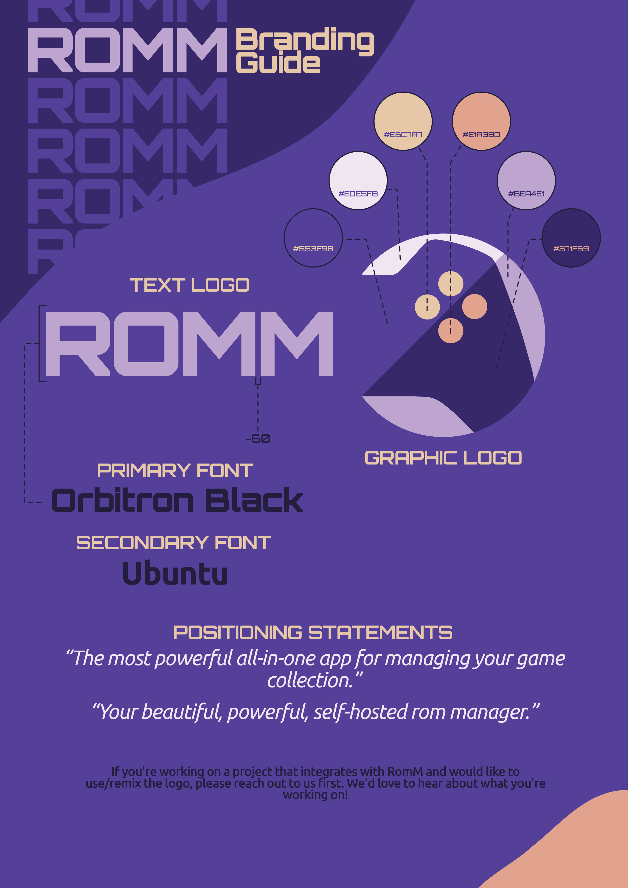

<!-- trunk-ignore-all(markdownlint/MD033) -->

# Brand Guidelines

In this context, "RomM", "The RomM Project", "the project", "we", "us", and "our" refer to the RomM project and organization.

## The logo

  
   
   

The logo should always be used in its standard colors:

  <table>
    <tr>
      <th>Color</th>
      <th>Hex</th>
    </tr>
    <tr>
      <td></td>
      <td><code>#371f69</code></td>
    </tr>
    <tr>
      <td></td>
      <td><code>#553e98</code></td>
    </tr>
    <tr>
      <td></td>
      <td><code>#ede5f8</code></td>
    </tr>
    <tr>
      <td></td>
      <td><code>#bea4e1</code></td>
    </tr>
    <tr>
      <td></td>
      <td><code>#e6c7a7</code></td>
    </tr>
    <tr>
      <td></td>
      <td><code>#e1a38d</code></td>
    </tr>
  </table>

## Do these things

- Use our logo to link to any page or site operated by the project.
- Use our logo in a blog post or news article about the project.
- Use our logo to inform others that your project integrates with RomM.
- Always use our logo in the colors provided.
- Always use our name in a way that makes clear you are not affiliated with the project.

If you're building something that integrates with RomM and would like to use / remix the logo, **please reach out first** via [Discord](https://discord.gg/romm). We'd love to hear about it.

## Please don't

- Use our name or logo in any way that suggests you are us, are endorsed by us, or are part of the project.
- Use our name or logo in a way that implies partnership, sponsorship, or endorsement.
- Use our name or logo as the name or logo for your project, product, service, social media account, company, or website.
- Use our name or logo to promote, advertise, or sell any private business, closed-source software, commercial product, or paid service.

## Downloadables

The logo assets live at [rommapp/romm/tree/master/frontend/assets/](https://github.com/rommapp/romm/tree/master/frontend/assets/):

- `isotipo.svg` / `isotipo.png`: the mark (circular logo).
- `logotipo.svg` / `logotipo.png`: the wordmark.
- `social_preview.png`: GitHub social preview.

## Questions

Ask on [Discord](https://discord.gg/romm) or open an issue.
