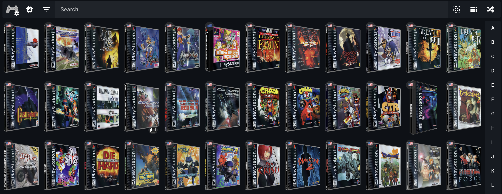
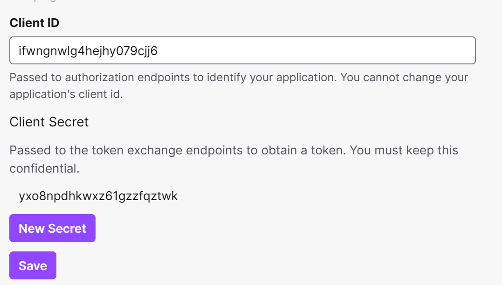
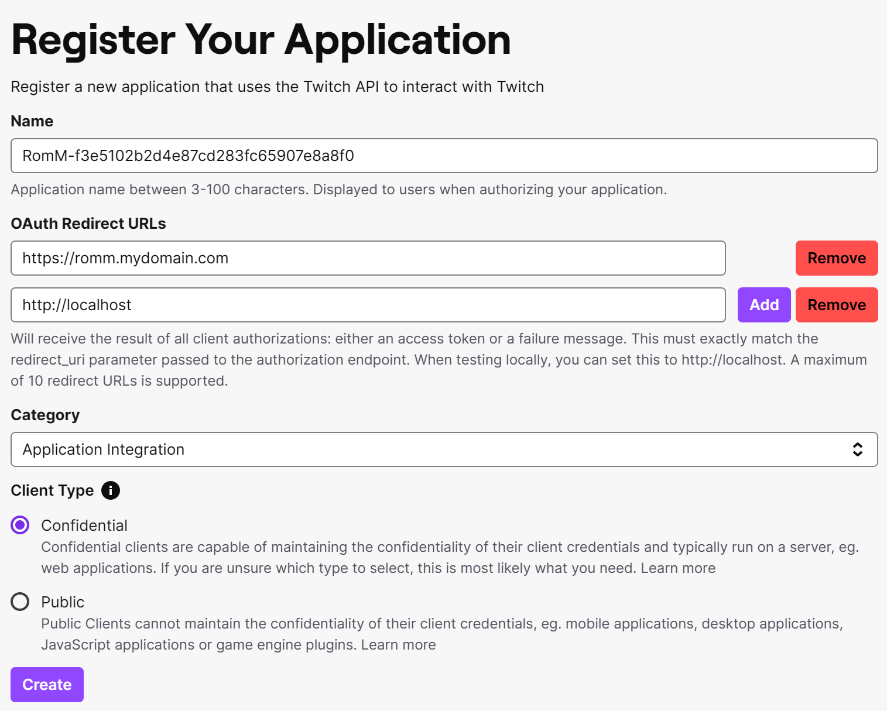
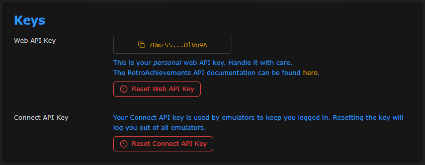
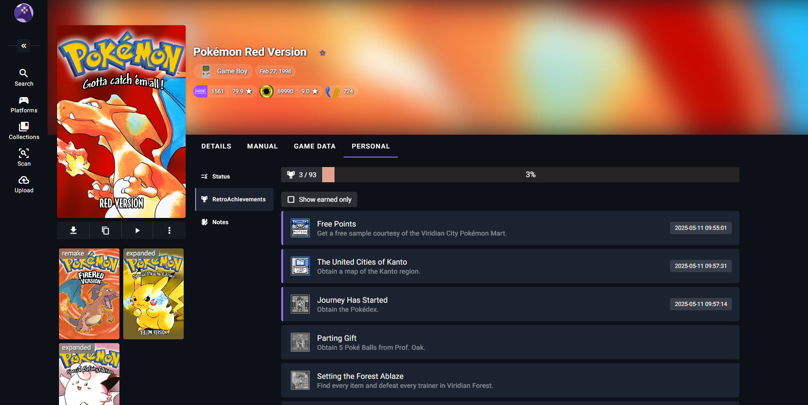

# Metadata Providers

RomM pulls game metadata — titles, descriptions, cover art, screenshots, manuals, achievement data, completion times — from up to **thirteen** providers. You don't need all of them. This page covers the recommended combinations and per-provider setup.

Configure providers either via env vars (below) or interactively in **Administration → Metadata Sources** in the UI. Scan priority (which provider wins when two disagree) is set in [`config.yml`](../reference/configuration-file.md) — see `scan.priority.metadata` and `scan.priority.artwork`.

## Popular combos

### ⭐ The Chef's Choice: Hasheous + IGDB + SteamGridDB + RetroAchievements

- Covers 135+ popular systems.
- **Hasheous** does hash-based matching and proxies IGDB data (titles, descriptions, artwork).
- **IGDB** adds related games, screenshots, and broader metadata.
- **SteamGridDB** provides high-quality alternative cover art (opt-in per game via the "search cover" button).
- **RetroAchievements** overlays achievement progress.
- **Recommended default for most users.**


### ⭐ The French Connection: ScreenScraper + RetroAchievements

- Covers 125+ popular systems.
- **ScreenScraper** provides titles, descriptions, cover art (2D + optional 3D + CD), screenshots, manuals. Also supports hash-based matching since RomM 4.4.
- **RetroAchievements** overlays achievement progress.
- **Pick this if you want to avoid anything Twitch/Amazon-owned.**



### The Twitch Fanboy: IGDB + PlayMatch

- Covers the 200+ systems IGDB knows about.
- IGDB-only metadata with PlayMatch's community-hosted hash-matching service bolted on for unmatched files.
- **Use if you specifically want a single-provider solution backed by IGDB.**

### The Quick Starter: Hasheous only

- Hash-based matching, fast scans, no API keys required.
- Proxies titles/descriptions/artwork from IGDB.
- **For users who want to avoid the IGDB/Twitch registration dance.**

## Setup instructions

### IGDB

[IGDB](https://www.igdb.com/) (Internet Game Database) is a popular metadata source with coverage for 200+ systems: titles, descriptions, screenshots, related games, and more.

Access requires a Twitch account and a phone number for 2FA. Up-to-date instructions live in the [IGDB API docs](https://api-docs.igdb.com/#account-creation). When registering your application in the Twitch Developer Portal:

- **Name**: something unique — picking an existing name fails silently. Use `romm-<random hex>`.
- **OAuth Redirect URLs**: `localhost`
- **Category**: Application Integration
- **Client Type**: Confidential

Set `IGDB_CLIENT_ID` and `IGDB_CLIENT_SECRET` from the values Twitch generates.

??? info "Screenshots"
    
    

### ScreenScraper

[ScreenScraper.fr](https://screenscraper.fr/) is a French provider with wide coverage and good artwork (2D, 3D, CD/cartridge).

[Register](https://www.screenscraper.fr/membreinscription.php), then set `SCREENSCRAPER_USER` and `SCREENSCRAPER_PASSWORD`.

### MobyGames

Metadata, cover art, and screenshots. [Create an account](https://www.mobygames.com/user/register/), visit your profile, and follow the **API** link to request a key. Set `MOBYGAMES_API_KEY`.

!!! important "MobyGames API is paid"
    Access to the MobyGames API is a [paid, non-commercial-licensed feature](https://www.mobygames.com/info/api/#non-commercial). RomM will continue to support it, but we recommend ScreenScraper as a free alternative.

### SteamGridDB

[SteamGridDB](https://www.steamgriddb.com/) serves custom cover art for games and collections. It's not used by the scanner directly — it surfaces in the **Search Cover** button when you manually edit a game's artwork.

Log in with a [Steam account](https://store.steampowered.com/join), go to your [API tab](https://www.steamgriddb.com/profile/preferences/api), and set `STEAMGRIDDB_API_KEY`.

### RetroAchievements

[RetroAchievements](https://retroachievements.org/) provides achievement data and hash matching. Generate a web API key from your RA [settings page](https://retroachievements.org/settings) and set `RETROACHIEVEMENTS_API_KEY`. Run an **Unmatched** scan on the platforms you want matched.

Each RomM user also links their own RA username in their profile to sync personal progression — a new **Achievements** tab appears on the **Personal** data panel once linked.

The RA database is cached locally; refresh frequency is controlled by `REFRESH_RETROACHIEVEMENTS_CACHE_DAYS` (default: 30).

??? info "Screenshots"
    
    

### Hasheous

[Hasheous](https://hasheous.org/) is free and open-source, does hash-based matching, and proxies IGDB data (no IGDB creds required on your side). Flag with `HASHEOUS_API_ENABLED=true`.

### PlayMatch

[PlayMatch](https://github.com/RetroRealm/playmatch) is a community-hosted hash-matching service. Pair it with IGDB for better matching on unmatched files. Flag with `PLAYMATCH_API_ENABLED=true`.

### LaunchBox

The [LaunchBox Games Database](https://gamesdb.launchbox-app.com/) is a community-driven catalogue. RomM downloads the full database locally and matches on exact filenames — just like the LaunchBox desktop app.

```yaml
environment:
  - LAUNCHBOX_API_ENABLED=true
  - ENABLE_SCHEDULED_UPDATE_LAUNCHBOX_METADATA=true
  - SCHEDULED_UPDATE_LAUNCHBOX_METADATA_CRON=0 5 * * *  # default: 5am daily
```

Run at least one LaunchBox update (manually from the Scan page, or wait for the cron) before using it as a scan source — RomM won't match against an empty local DB.

### TheGamesDB

[TheGamesDB](https://thegamesdb.net/) is a free community database that doesn't require credentials. Flag with `TGDB_API_ENABLED=true`.

### Flashpoint

The [Flashpoint Project Database](https://flashpointproject.github.io/flashpoint-database/) covers 180,000+ Flash and browser-based games — the thing Ruffle is for. Flag with `FLASHPOINT_API_ENABLED=true`. Run an **Unmatched** scan to update existing platforms.

### HowLongToBeat

[HowLongToBeat](https://howlongtobeat.com/) adds game completion times (Main, Main + Extras, Completionist) to supported games. Flag with `HLTB_API_ENABLED=true`.

A new **Time to Beat** tab appears on matched games' detail pages.

### gamelist.xml (ES-DE / Batocera)

If you came from EmulationStation / ES-DE / Batocera, you already have `gamelist.xml` files with metadata and media. RomM can parse these as a metadata source.

Expected layout:

```yaml
library/
└─ roms/
    └─ gba/
        ├─ game_1.gba
        ├─ game_2.gba
        ├─ gamelist.xml
        ├─ 3dboxes/
        ├─ covers/
        ├─ screenshots/
        └─ ...
```

#### ES-DE settings

Two edits in the ES-DE settings file so ES-DE writes its metadata and media into the RomM-expected location:

- Linux/macOS: `~/ES-DE/settings/es_settings.xml`
- Windows: `C:\Program Files\ES-DE\settings\es_settings.xml`

```xml
<string name="MediaDirectory" value="/path/to/ROMs/folder" />
<bool name="LegacyGamelistFileLocation" value="true" />
```

`MediaDirectory` puts artwork next to ROMs; `LegacyGamelistFileLocation` writes `gamelist.xml` next to ROMs instead of in the ES-DE config folder. If you already have scraped assets, move the contents of `~/ES-DE/downloaded_media/` and `~/ES-DE/gamelists/` into the ROM folders.

### Libretro

Libretro's retro core metadata is used internally for platform mapping and fallback artwork — no env flag, no credentials. Nothing to configure; RomM uses it automatically when it knows the libretro core for a platform.

## Metadata tags in filenames

RomM honours inline tags in ROM filenames to force a match against a specific provider ID:

| Tag | Provider |
| --- | --- |
| `(igdb-xxxx)` | [IGDB](https://www.igdb.com/) |
| `(moby-xxxx)` | [MobyGames](https://www.mobygames.com/) |
| `(ra-xxxx)` | [RetroAchievements](https://retroachievements.org/) |
| `(ssfr-xxxx)` | [ScreenScraper](https://screenscraper.fr/) |
| `(launchbox-xxxx)` | [LaunchBox](https://gamesdb.launchbox-app.com/) |
| `(hltb-xxxx)` | [HowLongToBeat](https://howlongtobeat.com/) |

RomM will **not** rename your files to add these — they're opt-in, and renaming would conflict with other tooling that walks the filesystem.

## Priority and conflict resolution

When multiple providers return different values for the same field, the winner is determined by `scan.priority.metadata` and `scan.priority.artwork` in `config.yml`. Defaults:

```yaml
scan:
  priority:
    metadata:
      - igdb
      - moby
      - ss
      - ra
      - launchbox
      - gamelist
      - hasheous
      - flashpoint
      - hltb
    artwork:
      - igdb
      - moby
      - ss
      - ra
      - launchbox
      - libretro
      - gamelist
      - hasheous
      - flashpoint
      - hltb
```

Reorder these lists to taste — for example, put `ss` first if you prefer ScreenScraper boxart, or move `hltb` up if you care about completion times more than descriptions.

See the full [Configuration File reference](../reference/configuration-file.md) for everything `scan.priority` can do.
