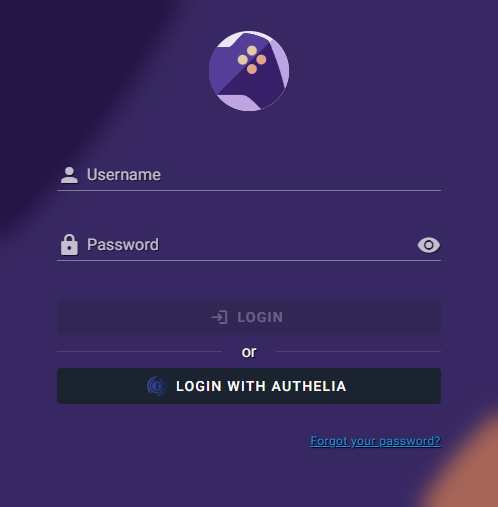

# OIDC with Authelia

[Authelia](https://www.authelia.com/) is a lightweight open-source authentication and authorisation server with two-factor auth and SSO. Good fit for homelabs that already proxy through a reverse proxy.

Before starting, read the [OIDC Setup overview](index.md). It covers the RomM-side settings common to every provider.

## 1. Prerequisites

Authelia installed and running, with its OIDC provider enabled. Upstream guides:

- [Authelia getting started](https://www.authelia.com/integration/prologue/get-started/)
- [OIDC provider configuration](https://www.authelia.com/configuration/identity-providers/openid-connect/provider/)

## 2. Add a claims policy

In Authelia's `configuration.yml` under `identity_providers.oidc.claims_policies`, add a policy that emits the claims RomM needs (name it whatever you like):

```yaml
identity_providers:
    oidc:
        claims_policies:
            with_email:
                id_token:
                    - email
                    - email_verified
                    - groups
                    - alt_emails
                    - preferred_username
                    - name
```

Background on why this is needed: [Authelia claims parameter restoration](https://www.authelia.com/integration/openid-connect/openid-connect-1.0-claims/#restore-functionality-prior-to-claims-parameter).

## 3. Register the RomM client

Under `identity_providers.oidc.clients`, add:

```yaml
identity_providers:
    oidc:
        clients:
            - client_id: "<random>" # see note below
              client_name: "RomM"
              client_secret: "$pbkdf2-sha512$<random>" # see note below
              public: false
              authorization_policy: "two_factor" # or one_factor
              grant_types:
                  - authorization_code
              redirect_uris:
                  - "https://romm.example.com/api/oauth/openid"
              claims_policy: "with_email" # must match the policy name above
              scopes:
                  - openid
                  - email
                  - profile
                  - groups
              userinfo_signed_response_alg: "none"
              token_endpoint_auth_method: "client_secret_basic"
```

Generating IDs and secrets: see [Authelia's FAQ](https://www.authelia.com/integration/openid-connect/frequently-asked-questions/#how-do-i-generate-a-client-identifier-or-client-secret). Full client schema: [Authelia clients reference](https://www.authelia.com/configuration/identity-providers/openid-connect/clients/).

## 4. Configure RomM

In the `romm` service environment:

```yaml
environment:
    - OIDC_ENABLED=true
    - OIDC_PROVIDER=authelia
    - OIDC_CLIENT_ID=<the client_id you picked>
    - OIDC_CLIENT_SECRET=<the plaintext client secret>
    - OIDC_REDIRECT_URI=https://romm.example.com/api/oauth/openid
    - OIDC_SERVER_APPLICATION_URL=https://auth.example.com
    - ROMM_BASE_URL=https://romm.example.com
```

`OIDC_REDIRECT_URI` must match what you put in `redirect_uris` exactly: scheme, host, path, no trailing slash.

For role mapping from Authelia groups, see [OIDC Setup → Role mapping](index.md#role-mapping-50).

## 5. Set your email on RomM

In RomM → **Profile** → set your email to exactly the same address Authelia has for you. RomM matches OIDC users to existing accounts by email.


## 6. Test

Restart RomM and open `/login`. There should be a **Login with OIDC** button alongside the username/password form. Click it → you're bounced to Authelia → authenticate → you're bounced back and signed into RomM.



If it doesn't work, head to [Authentication Troubleshooting](../../troubleshooting/authentication.md).
