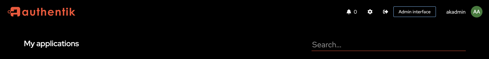
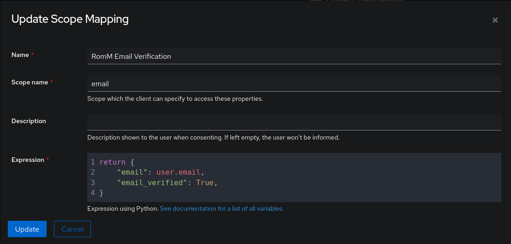
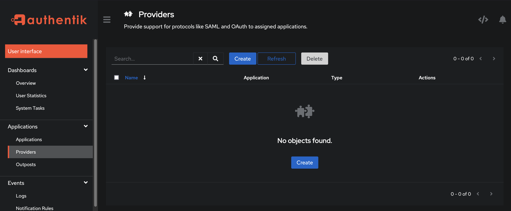
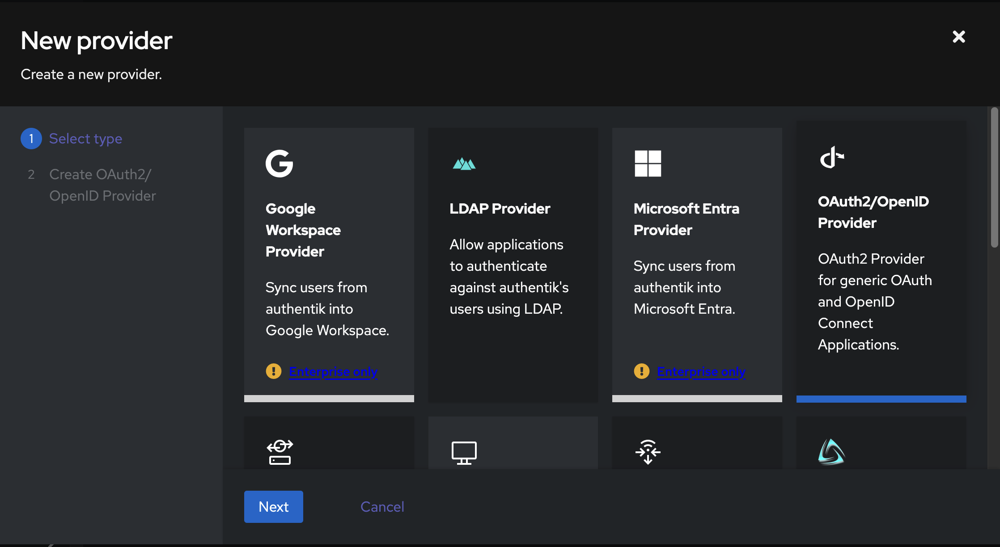
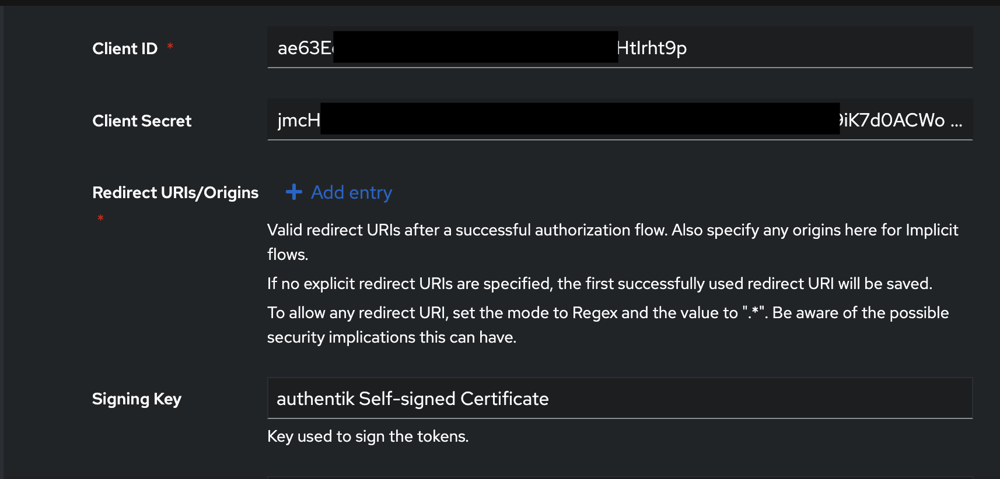
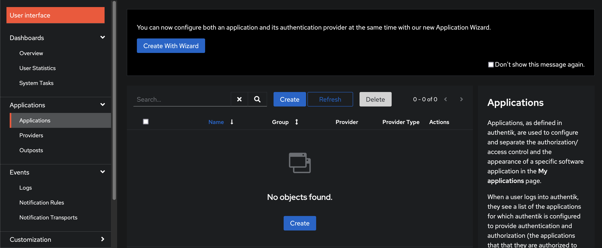
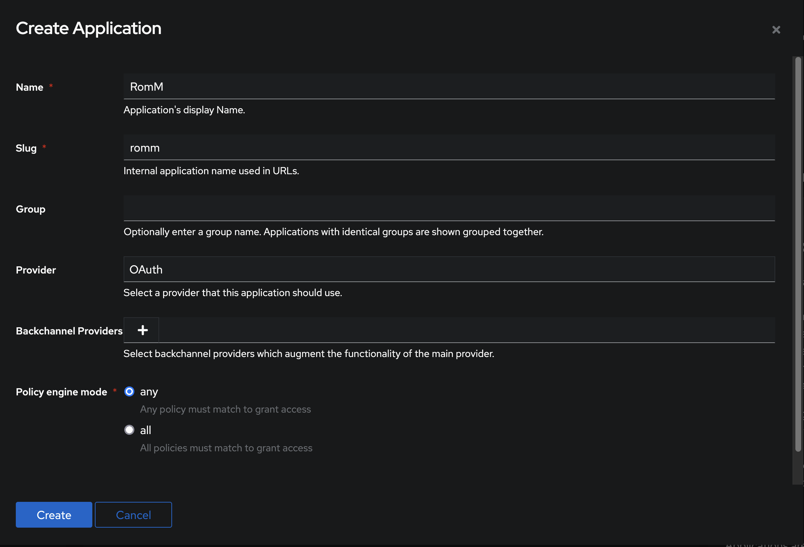
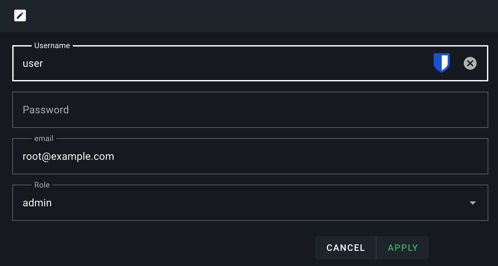
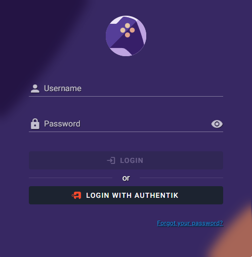

# OIDC with Authentik

[Authentik](https://goauthentik.io/) is a full-featured open-source IdP with MFA, flows, and a sizeable audit/admin surface. Good fit for users who want more than Authelia offers.

Before starting, read the [OIDC Setup overview](index.md). It covers the RomM-side settings common to every provider.

## 1. Prerequisites

Authentik installed and running. Upstream: [Docker Compose install guide](https://docs.goauthentik.io/docs/install-config/install/docker-compose).

Log in as admin and open **Admin Interface**.



## 2. Create a property mapping (Authentik 2025.10+)

!!! important "Authentik 2025.10 breaking change"
    In version 2025.10, Authentik changed the default of `email_verified` from `true` to `false`. RomM requires a verified email, so without this property mapping, authentication silently fails.

In **Customization → Property Mappings → Create → Scope Mapping**:

- **Name**: `RomM Email Verification`
- **Scope name**: `email`
- **Expression**:

    ```py
    return {
        "email": user.email,
        "email_verified": True,
    }
    ```



Click **Create**. Upstream reference: [Authentik scope mappings](https://version-2025-10.goauthentik.io/add-secure-apps/providers/property-mappings/#scope-mappings-with-oauth2).

## 3. Create a provider

**Admin → Providers → Create**.



Choose **OAuth2/OpenID Provider**.



Configure:

- **Name**: `RomM OIDC Provider`
- **Authorization flow**: implicit consent
- **Redirect URIs**: `https://romm.example.com/api/oauth/openid`

Copy the generated **Client ID** and **Client Secret**. You'll use them as `OIDC_CLIENT_ID` / `OIDC_CLIENT_SECRET` on the RomM side.



Click **Create**.

## 4. Register the application

**Admin → Applications → Create**.



- **Name**: `RomM`
- **Slug**: `romm`
- **Provider**: the `RomM OIDC Provider` you just made.



Click **Create**.

## 5. Configure RomM

```yaml
environment:
  - OIDC_ENABLED=true
  - OIDC_PROVIDER=authentik
  - OIDC_CLIENT_ID=<from Authentik>
  - OIDC_CLIENT_SECRET=<from Authentik>
  - OIDC_REDIRECT_URI=https://romm.example.com/api/oauth/openid
  - OIDC_SERVER_APPLICATION_URL=https://auth.example.com/application/o/romm
  - ROMM_BASE_URL=https://romm.example.com
```

Note `OIDC_SERVER_APPLICATION_URL` points at the per-application URL (`/application/o/<slug>`), not the Authentik root.

For role mapping from Authentik groups, see [OIDC Setup → Role mapping](index.md#role-mapping-50).

## 6. Set your email on RomM

In RomM → **Profile** → set your email to exactly the same address Authentik has for you.



## 7. Test

Restart RomM and open `/login`. Click the **Login with OIDC** button. You're redirected to Authentik, authenticate, and come back signed into RomM.



If it doesn't work, head to [Authentication Troubleshooting](../../troubleshooting/authentication.md).
