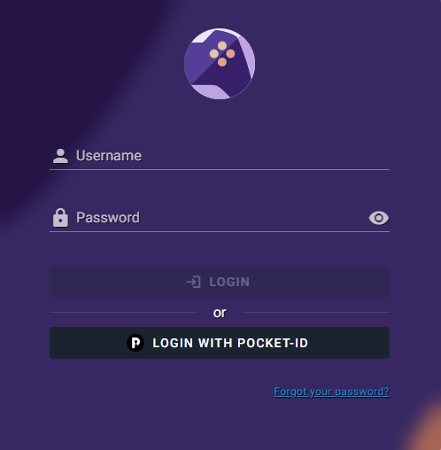

# OIDC with PocketID

[PocketID](https://github.com/stonith404/pocket-id) is a minimalist OIDC provider that **only** supports passkey authentication, with no passwords. Good fit when you want passwordless login end-to-end without the complexity of Keycloak or Authentik.

Before starting, read the [OIDC Setup overview](index.md); it covers the RomM-side settings common to every provider.

## 1. Prerequisites

PocketID installed, running, and your admin passkey already registered. Upstream setup: [PocketID setup guide](https://github.com/stonith404/pocket-id#setup).

## 2. Add the client

In PocketID admin:

1. **Application Configuration**: make sure **Emails Verified** is ticked. RomM requires verified emails.
2. Go to **OIDC Client** → **Add OIDC Client**.
3. Fill in:
    - **Name**: `RomM`
    - **Callback URLs**: `https://romm.example.com/api/oauth/openid`
4. **Save**. Stay on this page; the client secret only displays **once**. Copy both the Client ID and Client Secret now.

## 3. Configure RomM

```yaml
environment:
  - OIDC_ENABLED=true
  - OIDC_PROVIDER=pocket-id
  - OIDC_CLIENT_ID=<from PocketID>
  - OIDC_CLIENT_SECRET=<from PocketID>
  - OIDC_REDIRECT_URI=https://romm.example.com/api/oauth/openid
  - OIDC_SERVER_APPLICATION_URL=https://id.example.com
  - ROMM_BASE_URL=https://romm.example.com
```

`OIDC_SERVER_APPLICATION_URL` is the root URL of your PocketID instance.

## 4. Set your email on RomM

RomM → **Profile** → set your email to exactly the same address PocketID has for you.


## 5. Test

Restart RomM and open `/login`. Click **Login with OIDC**; you're redirected to PocketID, tap your passkey, and bounce back signed into RomM.



If it doesn't work, head to [Authentication Troubleshooting](../../troubleshooting/authentication.md).
