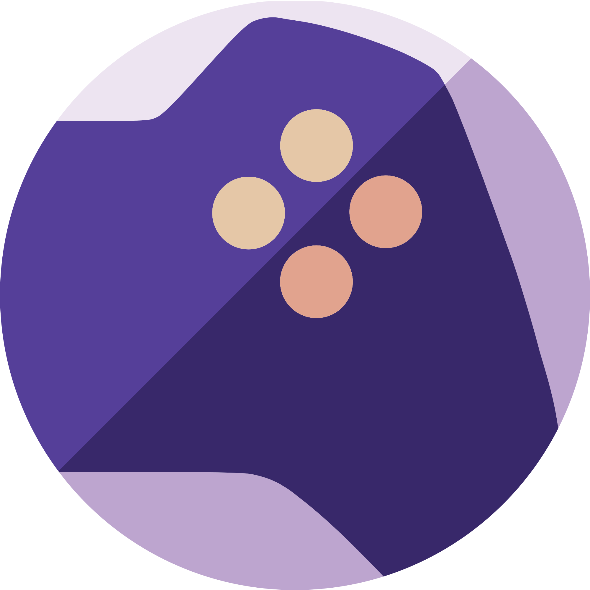

<!-- trunk-ignore-all(markdownlint/MD033) -->

/// caption
Welcome to the **RomM Project**, a self-hosted, open source ROM manager.
///

<a href="https://romm.app" target="_blank">Website</a> · <a href="https://demo.romm.app" target="_blank" >Demo</a> · <a href="https://discord.gg/romm" target="_blank">Discord</a>

Scan, enrich, browse and play your ROM collection from one free, self-hosted app, with metadata from 10+ providers, save sync across your devices, and support for over 400 platforms.

## Where do you want to go?

- :material-rocket-launch-outline: **I'm new, get me running**

    ***

    15 minute Docker Compose walkthrough to a working instance.

    [Quick Start →](getting-started/quick-start.md)

- :material-cog-outline: **I'm running RomM for my family/friends**

    ***

    Users, roles, OIDC, scheduled tasks, backups, reverse-proxy recipes.

    [Administration →](administration/index.md)

- :material-controller-classic-outline: **I just want to play**

    ***

    Library, collections, saves & states, streaming, netplay.

    [Using RomM →](using/index.md)

- :material-api: **I'm building on top of RomM**

    ***

    API reference, WebSockets, device sync protocol, client tokens.

    [Developers →](developers/index.md)

## Philosophy

RomM is self-hosted and open source, with no tracking and no upsells. The core app is licensed under [GNU AGPLv3](https://choosealicense.com/licenses/agpl-3.0/), and other projects in the umbrella use different licenses ([GPLv3](https://choosealicense.com/licenses/gpl-3.0/) or [MIT](https://choosealicense.com/licenses/mit/) for software, [CC0](https://choosealicense.com/licenses/cc0-1.0/) for documentation).

**RomM is and will always be free and open-source software.**

## Community

Join us on Discord to ask questions, share your setup, request features, or help other users. Code, issues, and releases live on [GitHub](https://github.com/rommapp/romm).

    

