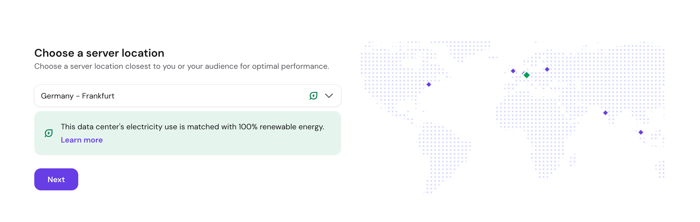
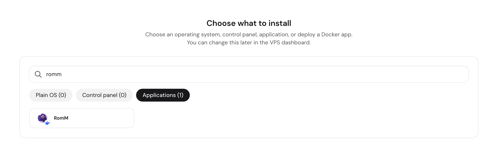
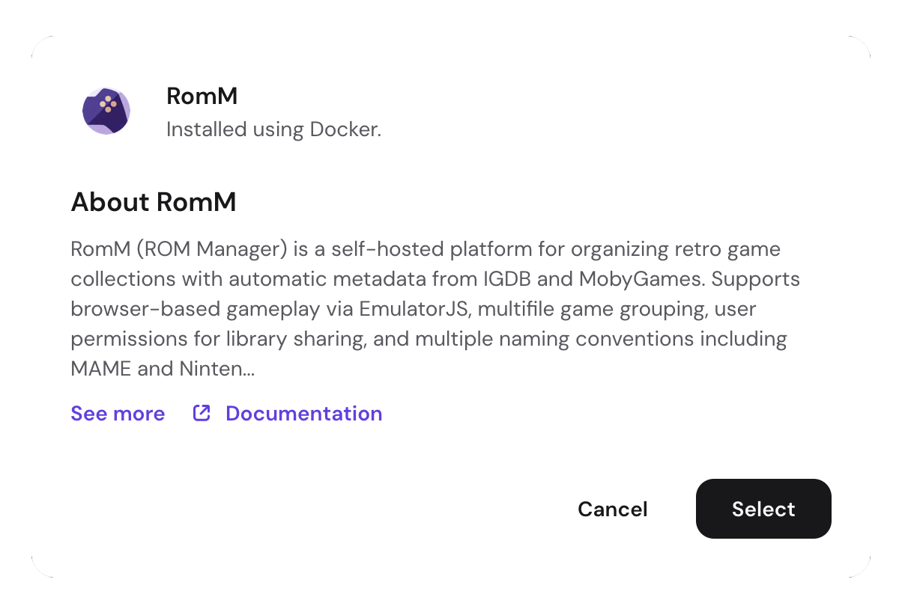
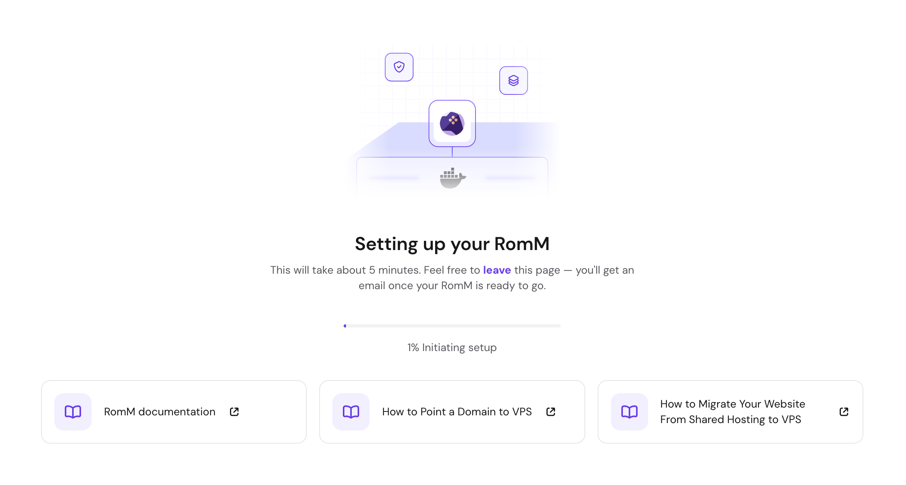
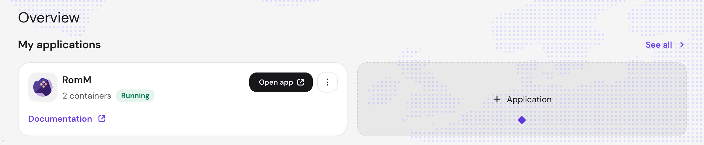
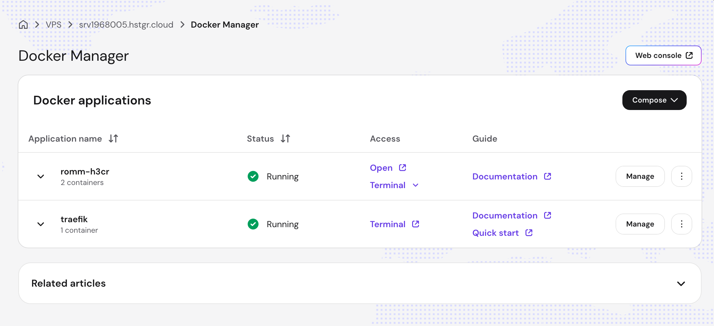
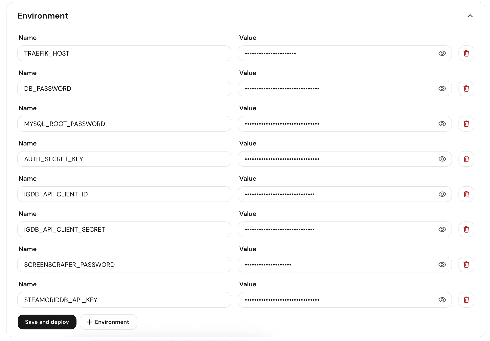
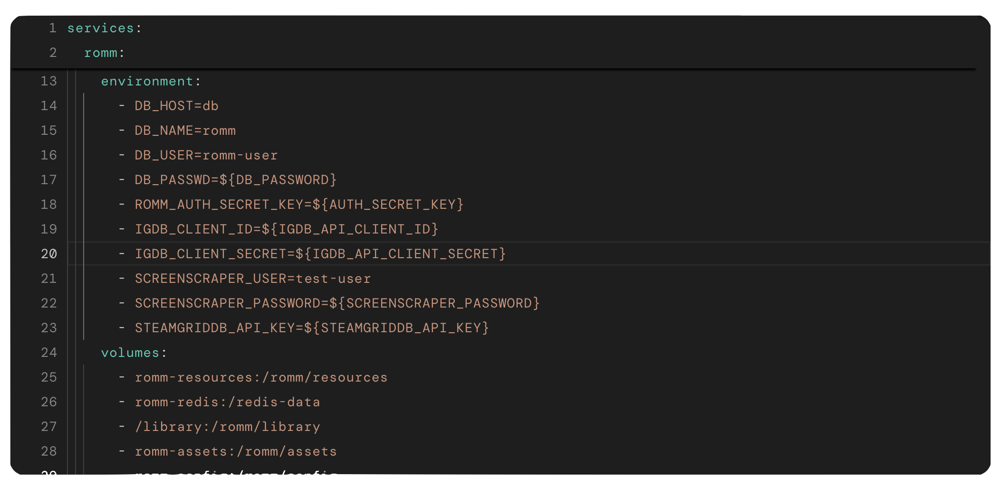

# Hostinger

[Hostinger](https://www.hostinger.com/applications/romm) ships RomM as a one-click application in its VPS catalog, so a fresh server comes up with the container, its database, and a reverse proxy already wired together. Hostinger builds and maintains the template, and the app itself is the same `rommapp/romm` image documented everywhere else in these docs.

[](https://www.hostg.xyz/aff_c?offer_id=815&aff_id=243561&url_id=6779)

<!-- prettier-ignore -->
!!! info "Supporting RomM"
    The button above is an affiliate link, and signups through it send a share of the revenue back to the project.

## What it deploys

The template creates two Docker applications on the VPS:

- **`romm-<suffix>`**: two containers, the RomM app and a MariaDB database. There is no third container for the in-memory store, since the template leaves `REDIS_HOST` unset and the image starts its [embedded Valkey](redis-or-valkey.md).
- **`traefik`**: one container, acting as the reverse proxy.

Resources, assets, and config live in named Docker volumes, while the library is a bind mount from a directory on the VPS, which is where you'll upload ROMs.

## Prerequisites

- A Hostinger VPS plan. The catalog offers the app on every tier down to the entry-level KVM 1, though your library shares the server's disk, so pick a plan whose storage fits your collection.

## Install

Start a new VPS order and pick a server location close to you.



On the **Choose what to install** step, search for `romm` and pick it from the **Applications** tab.



Confirm the app card with **Select**.



Hostinger then provisions the server and brings the stack up, which takes about five minutes. You can close the page, since an email arrives when it's ready.



When it finishes, the VPS **Overview** lists RomM under **My applications** with an **Open app** button.



Open it and the first-run **Setup Wizard** walks you through creating the first admin account.

## Managing the stack

**Docker Manager → Applications** lists both stacks with their status, a terminal, and a **Manage** button for each.



**Manage** on the RomM application is where you'll do everything after install, including editing environment variables, editing the compose file, viewing logs, and restarting or updating the containers.

## Configuration

The **Environment** section holds the values the template interpolates into the compose file, and **Save and deploy** applies a change by recreating the containers.



Fill in the metadata provider credentials before your first scan, since matching quality depends on them (see [Metadata Providers](../getting-started/metadata-providers.md)).

<!-- prettier-ignore -->
!!! tip "Names have to match the compose file"
    Each entry here is referenced from the compose file as `${NAME}`. If you rename a variable in the **Environment** section without renaming its reference, the container starts with that value empty rather than failing loudly.

The full compose file is editable under **.yaml editor**, which is the place to add volumes, change the image tag, or set env vars the template doesn't expose.



Everything in it is the standard configuration described in [Quick Start](../getting-started/quick-start.md) and the [Environment Variables reference](../reference/environment-variables.md).

## Adding ROMs

The library can live anywhere on the VPS disk, as long as the host directory is bind-mounted to `/romm/library` inside the container. The template mounts `/library`, and you can point it somewhere else by editing that line in the **.yaml editor**. Copy files to the host path over SFTP or SSH using the server's IP and the `root` credentials from the VPS overview:

```bash
ssh root@<vps-ip> mkdir -p /library/roms
scp -r ~/roms/gbc root@<vps-ip>:/library/roms/
```

Platform folder names inside `roms/` have to match the expected naming (see [Folder Structure](../getting-started/folder-structure.md)). Once the files land, run a scan (see [Your First Scan](../getting-started/first-scan.md)).

## Getting help

For problems with the VPS, the template, or Docker Manager, contact [Hostinger support](https://www.hostinger.com/contact), since they maintain the catalog entry. For issues with the app itself, try the [RomM Discord](https://discord.gg/P5HtHnhUDH) or:

- [Scanning Troubleshooting](../troubleshooting/scanning.md) for matching and ingest problems
- [Authentication Troubleshooting](../troubleshooting/authentication.md) for login issues
