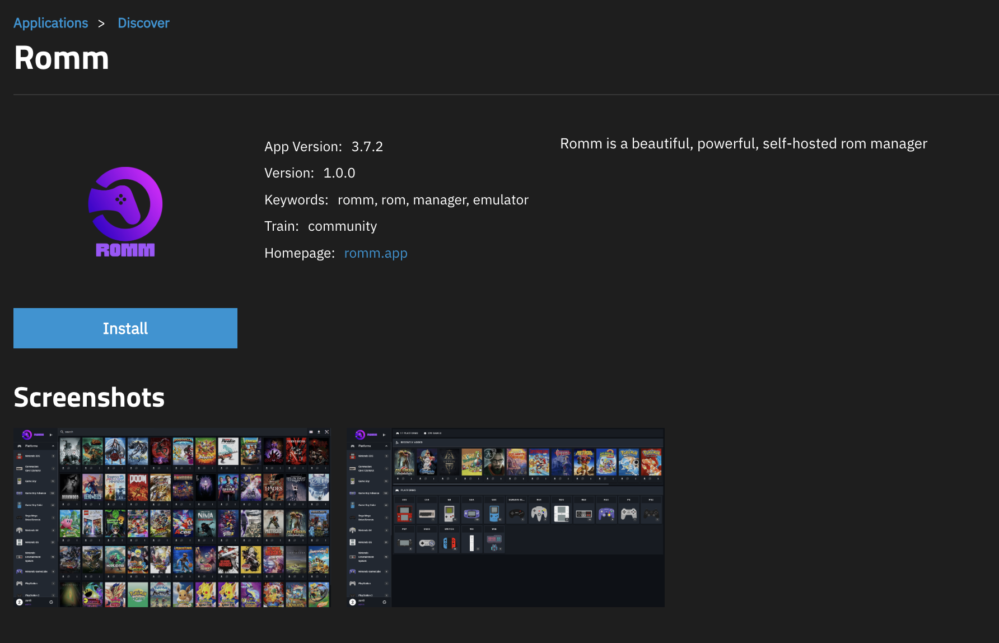
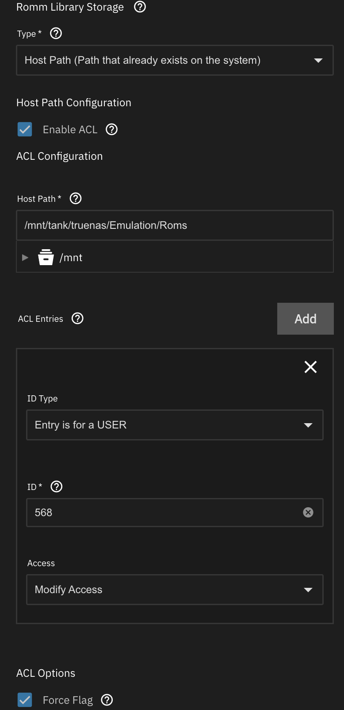
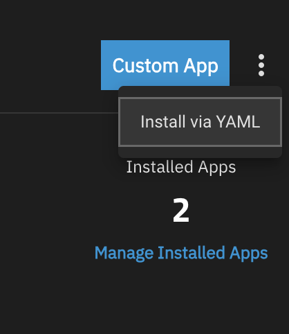

# TrueNAS

This guide covers **TrueNAS SCALE**. TrueNAS CORE isn't supported because its FreeBSD jail system doesn't run Docker images.

## Prerequisites

- A running TrueNAS SCALE installation
- Your ROM library arranged in the expected [folder structure](../getting-started/folder-structure.md)
- A TrueNAS user/group with a UID/GID that can own the dataset paths you.ll mount in

## Option A: App Catalog (recommended)

1. Open the RomM app

**Apps** (left nav) → **Discover Apps** → search `RomM` → **Install**.

2. Fill in the install form

Step through the installation UI. You'll be asked for the same set of env vars as [Quick Start](../getting-started/quick-start.md), and most defaults work. Things to look at:

- **Database credentials**: TrueNAS will offer to provision MariaDB for you. Just pick a strong password.
- **`ROMM_AUTH_SECRET_KEY`**: generate via `openssl rand -hex 32` on any Linux box and paste the output.
- **Metadata provider credentials**: fill in whatever you've registered for. See [Metadata Providers](../administration/metadata-providers.md).
- **Storage configurations**: point the **Library** and **Assets** volumes at datasets you control. Make sure the UID/GID defined in the app config (default: `568`, the `apps` user) has ACL access to those datasets.

3. Install

Save. TrueNAS provisions the container + DB + Valkey, runs migrations, and exposes the web UI on the port you configured. If it won't boot, jump to [Troubleshooting](#troubleshooting).

## Option B: Install via YAML

Use this path when the App Catalog has a bug, or when you want more flexibility than the install UI exposes.

1. Open the YAML install

**Apps** → **Discover Apps** → **Install via YAML**.

2. Paste the compose file

Fill in the empty values with credentials you created in [Quick Start](../getting-started/quick-start.md).

<!-- prettier-ignore -->
???+ example "docker-compose.yml"
    `yaml
        --8<-- "truenas.docker-compose.yml"
    `

3. Install

Save. Same troubleshooting applies, see below.

## Troubleshooting

### Generic

- Check you've filled in UIDs, GIDs, passwords, and any required API keys.
- Make sure the TrueNAS dataset permissions allow the chosen UID/GID to read/write.
- Watch the app's terminal / logs during startup for clues.

### Permission errors inside the container

If you're seeing permission errors on paths _inside_ the container (not on TrueNAS datasets), try temporarily running the container as root (`user: 0`) to unblock yourself, fix the offending permissions via shell, and switch back to a non-root user.

In at least one reported setup, creating a user/group in TrueNAS with UID/GID `1000:1000` and the auxiliary `apps` group was needed to get the app talking to its embedded Valkey cleanly.

### Other issues

- [Scanning Troubleshooting](../troubleshooting/scanning.md) for matching / ingest problems
- [Authentication Troubleshooting](../troubleshooting/authentication.md) for login issues
- The [Discord](https://discord.gg/P5HtHnhUDH) has a `#truenas` channel with active community troubleshooting.

## Contributing

Suggestions welcome. PRs against [rommapp/docs](https://github.com/rommapp/docs).
