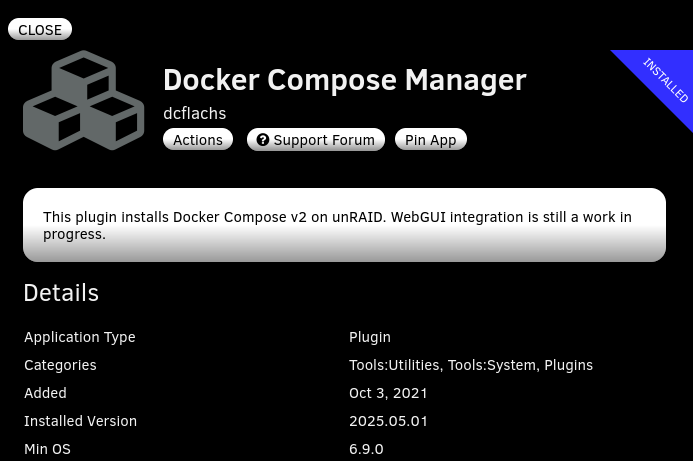
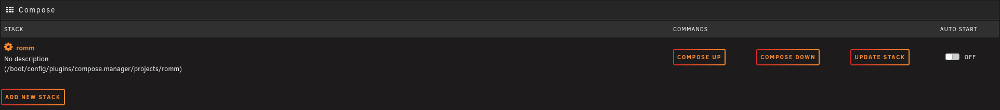
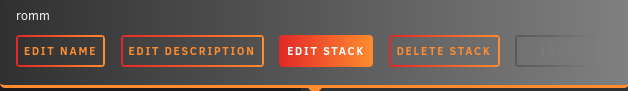
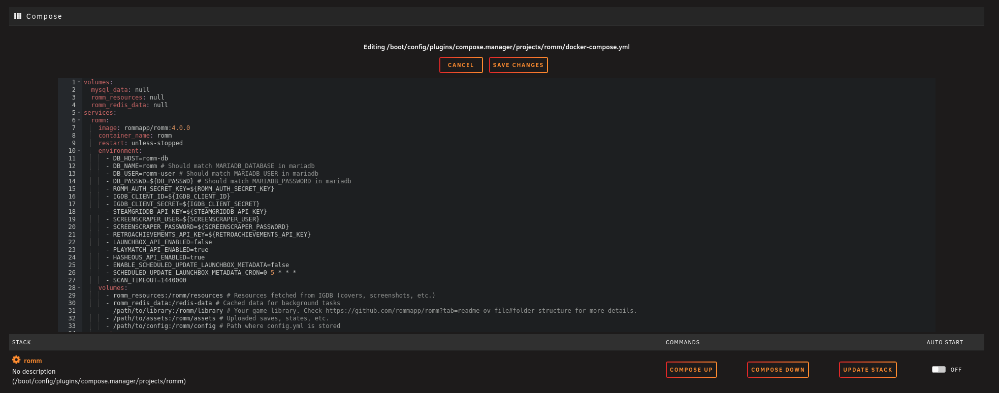
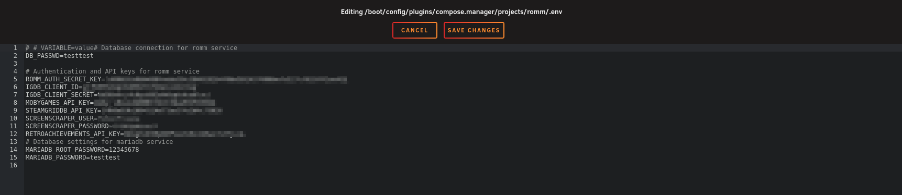
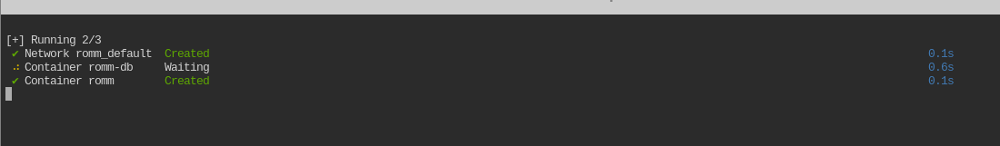
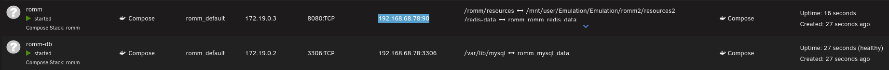
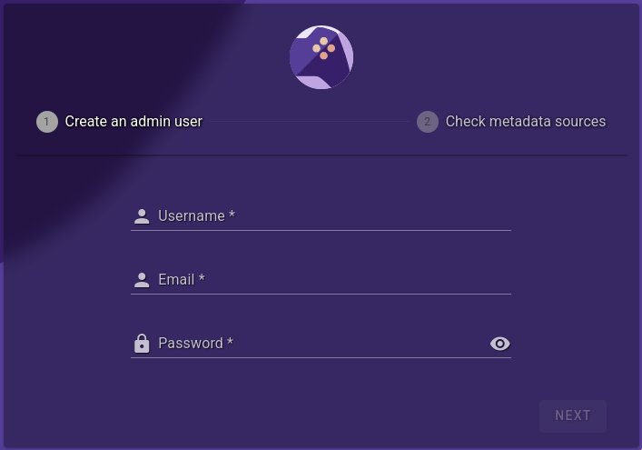

# Unraid

Two supported install paths on Unraid. Pick one:

- **[Community Apps template](#community-apps-template)** — simplest. Install RomM and MariaDB as separate CA templates. Good for users who already manage containers one-at-a-time.
- **[Docker Compose Manager](#docker-compose-manager)** — closer to the upstream reference setup. Drops the standard `docker-compose.yml` in and uses the Compose plugin to manage it. Recommended if you're comfortable editing Compose files and want parity with other deployments.

Both end up with the same running stack.

!!! warning "Back up `appdata` before updates"
    Tearing down the RomM container wipes its resources directory (covers, screenshots, cached metadata). Mount `appdata` on a safe path or [back it up](backup-and-restore.md) before every upgrade.

---

## Community Apps template

### Prerequisites

- [Community Apps plugin](https://forums.unraid.net/topic/38582-plug-in-community-applications/) installed.
- A custom Docker bridge network so RomM and MariaDB can talk to each other by container name. Skip this and you'll hit DNS issues that look like everything else.

    ```sh
    docker network create romm
    docker network ls  # confirm `romm` is listed
    ```

    

### 1. Install MariaDB

From **Apps** → search `mariadb`. Only the [official `mariadb`](https://hub.docker.com/_/mariadb) and [linuxserver/docker-mariadb](https://github.com/linuxserver/docker-mariadb/pkgs/container/mariadb) templates are supported — **prefer the official one**.


Fill in the env vars — names and sensible defaults live in the [reference `docker-compose.yml`](docker-compose.md). Set the network to **Custom: romm**.


!!! warning "Network type"
    MariaDB's network type **must** be set to `Custom: romm`. Otherwise RomM can't resolve its hostname.

### 2. Install RomM

From **Apps** → search `romm` → install the app labelled **OFFICIAL** (maintained by the RomM team, always current).


Fill in env vars, ports, and paths per the [reference compose](docker-compose.md). Again, network type → `Custom: romm`.


### 3. Done

Apply, head back to the **Docker** tab, and you should see both containers running. Access RomM at the IP:port highlighted below.


---

## Docker Compose Manager

### Prerequisites

- [Community Apps plugin](https://forums.unraid.net/topic/38582-plug-in-community-applications/).
- [Docker Compose Manager plugin](https://forums.unraid.net/topic/114415-plugin-docker-compose-manager/) from CA.

    

After installing, a **Compose** section appears under the Docker Containers list on the Docker tab.



### 1. Add the stack

**Add New Stack** → name it **RomM** → OK.

Click the gear icon → **Edit Stack** → **Edit Compose**.



Paste the [reference `docker-compose.yml`](docker-compose.md) and fill in your env vars (API keys, MariaDB creds, metadata providers). You can keep secrets in a separate `.env` file — edit the environment file via the gear icon.





Save after each edit.

!!! warning "Folder structure"
    Make sure your library matches one of the [supported folder layouts](../getting-started/folder-structure.md) before scanning — Unraid users often forget this step.

### 2. Bring it up

Click **Compose Up**.



Copy `IP:Port` from the RomM container and open it in a browser — the first-run Setup Wizard should appear.





---

## Video walkthroughs

Community-made, still relevant for general Unraid/RomM debugging even if specific UI screens have drifted.

[DemonWarriorTech](https://www.youtube.com/@DemonWarriorTech) — [How to Install RomM on Unraid (Beginner Friendly)](https://www.youtube.com/watch?v=Oo5obHNy2iw):

[](https://www.youtube.com/watch?v=Oo5obHNy2iw)

[AlienTech42](https://www.youtube.com/@AlienTech42) — [older install + debugging walkthrough](https://www.youtube.com/watch?v=ls5YcsFdwLQ). Install steps are out of date, but the general-setup and debugging portions still hold.

[](https://www.youtube.com/watch?v=ls5YcsFdwLQ)

## Unraid community support

Dedicated [Unraid forums support thread](https://forums.unraid.net/topic/149738-support-eurotimmy-romm-rom-manager-by-zurdi15/) — good for Unraid-specific questions that aren't in the RomM Discord's Unraid channel.

## Shout-outs

Thanks to @Smurre95 and @sfumat0 for documenting this process and getting RomM listed in Community Apps.
