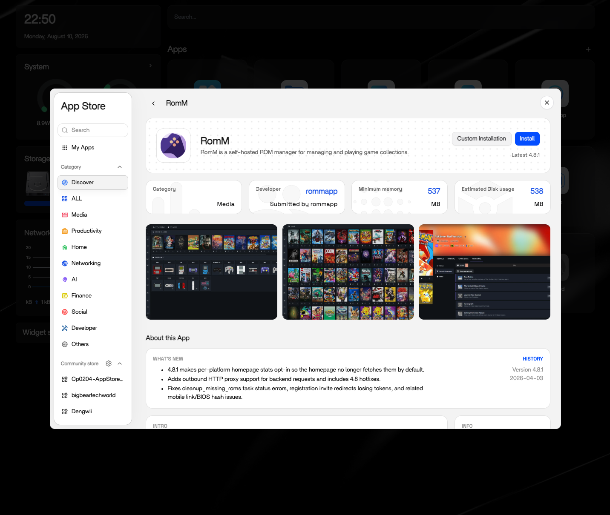
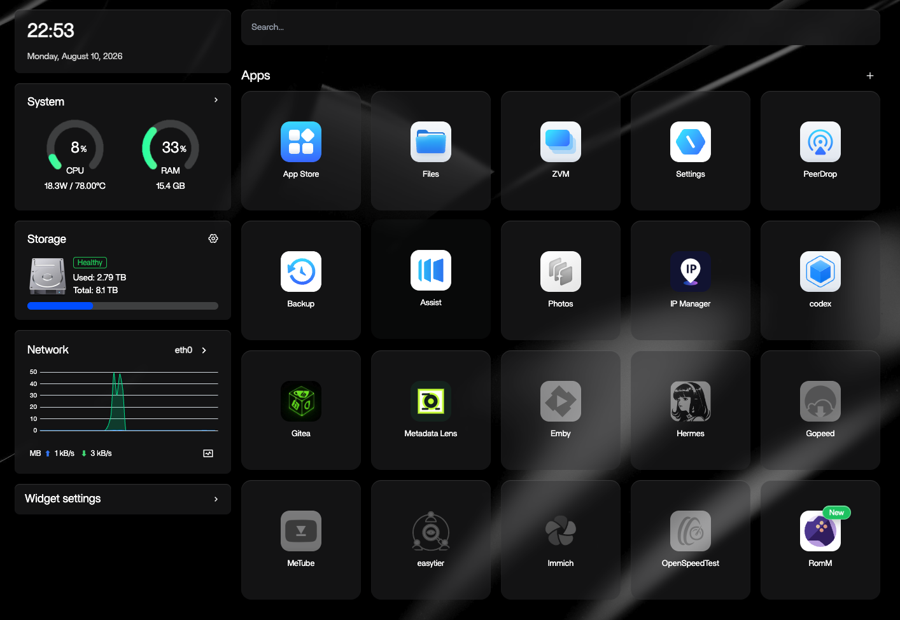
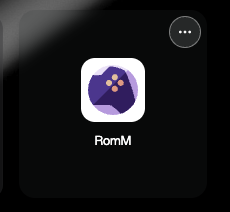
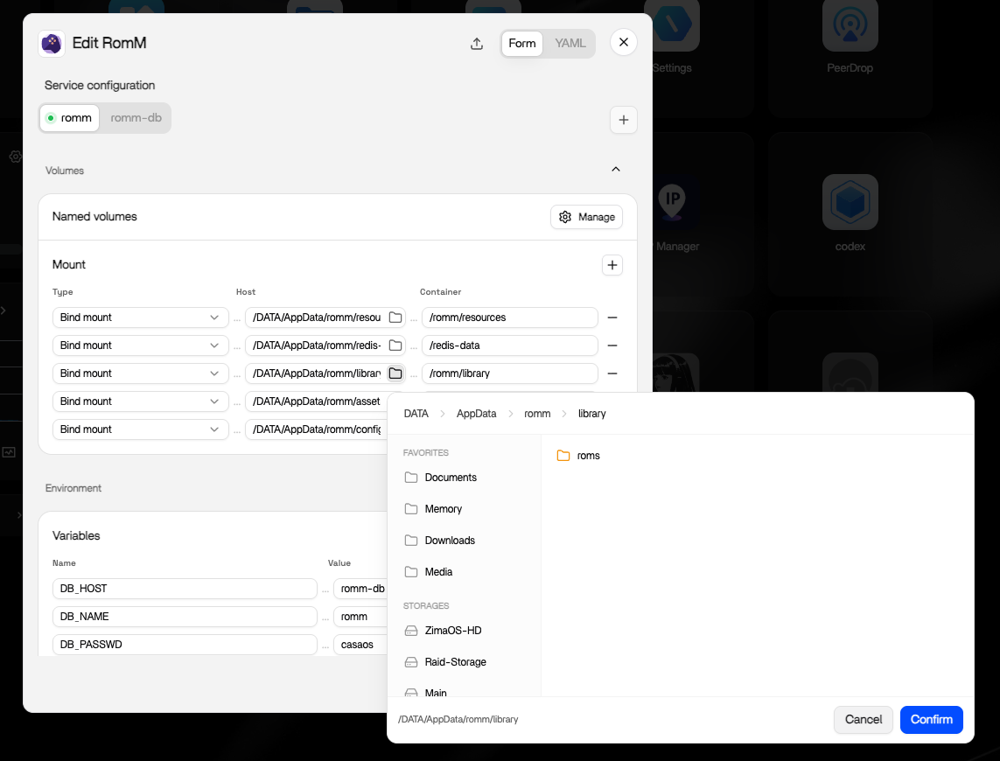

# ZimaOS

[ZimaOS](https://www.zimaspace.com/zimaos) ships RomM in its App Store, so the install is a single click and no compose file or database setup is needed.

## Prerequisites

- A running ZimaOS installation
- Your library arranged in the expected [folder structure](../getting-started/folder-structure.md)

## Install

Open the **App Store** and search for `RomM`, then hit **Install**.

ZimaOS provisions the container along with its database and Valkey, and the app shows up on your home screen when it's ready.

Open it and the first-run Setup Wizard walks you through creating the first admin account.

## Configuration

The defaults work out of the box, so everything below is optional.

To change container settings, use the options button in the upper-right corner of the app tile. ZimaOS offers both a form-based editor and a YAML editor for the underlying compose file, so you can set volumes, ports, and env vars either way.

The env vars are the same ones documented in [Quick Start](../getting-started/quick-start.md) and the [Environment Variables reference](../reference/environment-variables.md). Two worth setting early:

- **`ROMM_AUTH_SECRET_KEY`**: generate one with `openssl rand -hex 32`. Rotating it later invalidates every session and invite link.
- **Metadata provider credentials**: fill these in before your first scan (see [Metadata Providers](../getting-started/metadata-providers.md)).

## Adding ROMs

Open **Files** in ZimaOS, navigate to the directory you mapped to the library (`AppData/romm/library/roms` by default), and drag your files in to upload. Platform folder names inside `roms/` have to match the expected naming (see [Folder Structure](../getting-started/folder-structure.md)).

Once the files land, run a scan from the app (see [Your First Scan](../getting-started/first-scan.md)).

## Getting help

For ZimaOS-specific problems, the [ZimaSpace Discord](https://discord.gg/f9nzbmpMtU) is the fastest route, since their team and community maintain the App Store entry. For issues with the app itself, try the [RomM Discord](https://discord.gg/P5HtHnhUDH) or:

- [Scanning Troubleshooting](../troubleshooting/scanning.md) for matching and ingest problems
- [Authentication Troubleshooting](../troubleshooting/authentication.md) for login issues
